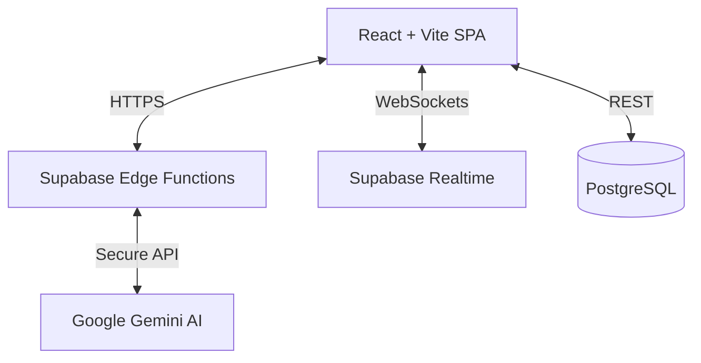

# 🏛️ Samadhan - Your Civic Companion

**Samadhan** is a modern civic engagement platform designed to bridge the gap between citizens and local administration. It empowers users to report civic issues, access government schemes, and get instant assistance via an AI-powered voice assistant.

## 🚀 Features

### 📢 Issue Reporting System

* **Categorized Reporting:** Report issues like Water, Electricity, Roads, and Sanitation.
* **Voice-to-Text:** Record issue descriptions using the integrated Voice Assistant.
* **Location Tagging:** Automatically captures location data for accurate reporting.

### 📊 Community Dashboard

* **Real-time Feed:** View issues reported by the community instantly (powered by Supabase Realtime).
* **Support System:** Upvote/Support issues to highlight urgency.
* **Status Tracking:** Track issues from "Reported" to "Resolved".

### 🤖 Samadhan AI Assistant

* **24/7 Chatbot:** Powered by **Google Gemini 1.5 Flash**.
* **Multilingual:** Supports queries in **Hindi & English**.
* **Contextual Help:** Answers questions about schemes, forms, and civic rights.

### 🔐 value-add Services

* **Document Locker:** Securely store IDs and verification documents.
* **Scheme Discovery:** AI-matched government schemes based on user profile.
* **Form Analyzer:** Upload government forms to get simplified AI explanations.

---

## 🛠️ Tech Stack

### **Frontend**

* **Framework:** React + Vite
* **Language:** TypeScript
* **Styling:** Tailwind CSS + shadcn/ui
* **State Management:** TanStack Query (React Query)

### **Backend (Serverless)**

* **Platform:** Supabase (BaaS)
* **Database:** PostgreSQL with Row Level Security (RLS)
* **Auth:** Supabase Auth (Email/Password)
* **Realtime:** Supabase Realtime (WebSockets)
* **Edge Functions:** TypeScript (Deno) for secure AI proxy

### **External Services**

* **AI Model:** Google Gemini API
* **Maps:** Google Maps / OpenStreetMaps (Planned)

---

## 🏗️ Architecture

The application follows a serverless architecture to ensure low costs and high scalability.



---

## ⚡ Getting Started

### Prerequisites

* Node.js (v18+)
* npm or bun
* A [Supabase](https://supabase.com/) project
* A [Google AI Studio](https://aistudio.google.com/) API Key

### Installation

1. **Clone the repository**
```bash
git clone https://github.com/kanishq09/your-civic-companion.git
cd your-civic-companion

```


2. **Install dependencies**
```bash
npm install

```


3. **Environment Setup**
Create a `.env` file in the root directory:
```env
VITE_SUPABASE_URL=your_supabase_project_url
VITE_SUPABASE_ANON_KEY=your_supabase_anon_key
VITE_SUPABASE_PUBLISHABLE_KEY=your_supabase_publishable_key

```


4. **Run Development Server**
```bash
npm run dev

```


### Backend Setup (Supabase)

1. Run the migration files located in `supabase/migrations` to set up tables (`reported_issues`, `profiles`, etc.).
2. Deploy the Edge Function for AI chat:
```bash
supabase functions deploy samadhan-chat --no-verify-jwt
supabase secrets set GEMINI_API_KEY=your_google_api_key

```


---

## 💰 Scalability & Costs

This project is designed to be cost-effective, starting with a free tier and scaling based on usage.

| Component | MVP / Hackathon | Professional Scale (10k Users) |
| --- | --- | --- |
| **Backend** | **$0** (Free Tier) | **$25/mo** (Pro Plan) |
| **AI (Gemini)** | **$0** (Rate Limited) | **~$5-30/mo** (Flash Model) |
| **Hosting** | **$0** (Vercel Hobby) | **$20/mo** (Pro) |
| **Total** | **Free** | **~$50/month** |

---

## 🤝 Contributing

Contributions are welcome! Please run the linter before submitting PRs.

```bash
npm run lint

```

## 📄 License

This project is licensed under the MIT License.
